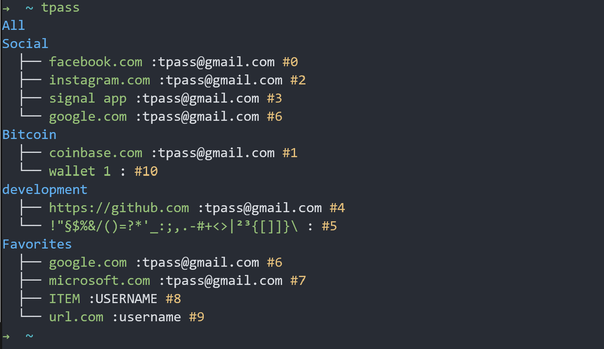

.. tpass documentation master file, created by
   sphinx-quickstart on Fri Aug 23 14:37:27 2019.
   You can adapt this file completely to your liking, but it should at least
   contain the root `toctree` directive.

tPass
=======================================

CLI for Trezor Password Manager
-------------------------------

**tPass** is build with simplicity in mind. It should be 100% compatible with
Trezor Password Manager. Every output could be the input for another
application, which means it's scriptable. The application is cross plattform and
runs on Linux, Windows and MacOS. All the crypto implementation is handled by 
Trezor Device. The Input and CLI methods are implemented with click. The 
functionality is inspired by **pass**, the standard unix password manager.

.. toctree::
   :maxdepth: 2
   :caption: Contents:

   install
   manual
   design
   contribute

Indices and tables
~~~~~~~~~~~~~~~~~~

* :ref:`search`
